多人在线五子棋对战平台
=== 

 （以下内容是直接从课程设计报告中复制过来的，加上一些解释的代码，水了一万六的字数~~）

# 一、程序背景

​    计算机网络的迅速发展，对游戏领域产生了巨大影响。尤其是随着信息时代的来临，人们越来越趋向于网络游戏来进行竞技，于是，各式各样的网络游戏应运而生，例如腾讯游戏，网易游戏。在这些平台上，五湖四海的玩家可以随意地竞争与合作，适当的娱乐可以很好地纾解生活压力，为家庭、事业都有巨大的积极作用。因此，开发和架构这种轻游戏平台符合时代发展的需要。

# 二、设计原理及要求

(1）设计原理：

​    本系统主要由四个子模块组成：五子棋游戏、网络通信、用户系统、积分系统。

(2）设计要求：

a) 采用Ｃ／S模式架构, 能够同时支持至少40对玩家

b) 服务器端提供游戏大厅、游戏桌等。

c) 对战平台提供的游戏：五子棋或其它等。

# 三、程序介绍

此程序主要分为两个部分：服务端和客户端。

游戏服务端用于存储和转发信息，收到用户的登录、准备、落子等主动信号，进行相关的数据运算，并发送回用户。

游戏客户端可通过服务端的IP地址发送连接请求，然后登录到游戏大厅，没有账号则需要先注册。在服务端中会维护一个session列表，即在线用户名单，还有所有游戏桌状态数组，保存所有游戏桌的人数情况以及准备情况。有人进入游戏桌、开始准备游戏、开始游戏、落子、游戏结束、离开游戏桌等，服务端都会收到相应的数据，此时服务器作为一个存储器和转发站，保存所有用户的游戏状态，并转发消息给相关的用户。用户排名也会显示在对应的客户端上，可自行查看排行榜。本游戏人数理论上无上限，可修改宏定义的数值参数来设置人数上限。

# 四、程序的功能描述

## （1)    开始会话

启动客户端时，便会尝试连接至服务器。连接成功后会在服务器的会话列表中新增一个封装过的session类，这个session类保存会话用户的信息，包括用户ID、用户账号、用户排名、用户状态等。

处理完成后向客户端发游戏大厅中所有桌子的游戏状态，将有人的桌子改变颜色。

所有的传输的数据格式都是XML，以便于提取数据。服务端和客户端皆有特定的函数专门用来处理传输的XML数据，同时用递归的方式解决了Socket带来的数据缓冲区问题，即多条数据会合在一起发送给客户端，导致有一定的几率分析失败，产生逻辑上的错误。

## （2)    注册

服务器收到用户的注册数据，便开始提取数据中的有用信息，包括用户名、密码，可注册的话则为其生成一个唯一的用户ID，确保此用户为本游戏平台中独一无二的玩家对象。接着向存储的数据中添加新用户的记录，初始化积分。客户端收到注册成功的信号，获取用户ID，开始正常游戏。注册后可通过点击游戏大厅的用户名按钮，来查看所有用户的数量（因为新账号的排名就是所有用户数量）。

## （3)    登录

在客户端，用户输入其账号密码后，服务器收到用户的登录数据，提取中数据中的用户名和密码，和用户列表中的数据进行配对。如果失败则返回错误提示。如果匹配成功，则在session列表中逐一比较，避免同一用户多设备同时登录，扰乱游戏积分系统。登录后返回用户的ID、昵称、积分等个人信息。

登录成功后可通过点击游戏大厅的用户名按钮，来查看自己所在的位置，以及所有用户的账号与排名。

## （4)    进入游戏桌

这需要登录后才能进入游戏桌。每个游戏桌分为两个座位，分别为黑子、白子，先进来的玩家默认为黑棋，后进来的为白棋。玩家加入游戏桌后，对应位置上的区域将会出现头像，表示这个位置有人，状态文字也变成“未准备好”，出现“准备完毕”的按钮。

大厅的桌子预览图列表中白色的座位图标会变成黑色，并且上面显示玩家昵称。

## （5)    离开游戏桌

玩家离开桌子回到大厅时，游戏桌上的玩家头像消失，大厅中的游戏桌预览图列表的黑色座位变回白色，表示这个位置的玩家已经离开了，其他玩家随时可上去与其他玩家开始游戏。如果在激战中退出离开游戏桌，确认后即视为放弃比赛，主动认输，另一方无条件获胜。

## （6)    准备开始游戏

刚开始加入游戏桌时皆为未准备状态，需要手动点击“准备完毕”表示自己已经准备好，随时可以开始游戏。双方玩家都能看到对方的准备状态，以便于自己是否确认开始进行对战。双方都准备完毕时，收到服务器发送的对战信号，将马上开始对战。

## （7)    开始游戏

准备完毕时，客户端向服务端发送准备的信号，当同一桌双方玩家都准备完毕后，立即开始比赛。客户端发送start信号给游戏桌的双方客户端，客户端进行游戏初始化，包括棋盘数据清空、棋盘控件清空棋子和更新界面、设置黑子先手、五子棋AI初始化、确定各自棋子的颜色，开始进行五子棋对战。

## （8)    落子

游戏双方的每一次落子都会向服务器发送落子的信号，传输的数据中同时含有自身的信息，比如桌子ID、座位ID等，避免在数据传输的过程中丢包而导致的一些逻辑问题。服务端判断收到的用户座位是不是与保存的用户状态的列表中的数据一致，如果不一致则是有错误，需要进行纠错；如果没有错误就转发落子的数据给另一方的客户端，在客户端中模拟玩家进行落子。遇到错误后服务端会进行处理，并返回尽量减少错误损失的数据，交给客户端处理。

## （9)    放弃游戏

在对战中关闭棋盘窗口，则视为放弃本次比赛，对方无条件获胜。退出的一方将会警告扣除积分，但并不会真的扣除。胜利方也不会获得奖励，避免刷分操作。离开后失败方的头像将会消失，原来的头像下方的文字变为“对方已放弃”，并且字体变灰。

判断双方处在对战中的逻辑是同一游戏桌的两名玩家都已经准备完毕，服务端中有一个维护所有桌子座位状态的数组，0为没有玩家， 1为有玩家但没有准备好，2为有玩家并且准备完毕。如果双方都已经准备，则会立即开始比赛，所以两边都准备的情况下必定是正在比赛。

## （10)  游戏胜利

客户端落子时发送数据给服务端，接着调用五子棋的AI判断自己是不是胜利。如果是胜利，则发送胜利的信号给服务端，在服务端中分析对战的双方局势，判断是不是真的胜利。最后一颗棋子也会发送给失败方，以便于两边的棋谱同步。确定数据无误后在服务端通过落子数量获得胜利者应该获得的积分，转发给胜利的玩家客户端。失败者也会获得少量的积分奖励，积分约为胜利者的三分之一。游戏结束后双方的准备状态清空，胜利方状态变为金色，失败方状态变为灰色，同时需要重新点击“继续下一局”按钮来和对方继续下一句对战。

## （11)      积分奖励

每胜利一局，都会获得大量的积分，计入自己的总积分。服务端会进行累加，并保存到用户数据中。失败者获得少量的积分，也会累加到用户数据中，并保存到文件，实时保存积分以便于下次启动服务端时重新读取数据，同时也是避免了数据丢失。

## （12)      用户排名

在服务端中维护了一个用户列表，是从数据文件中读取的。每一个用户列表中都有封装好的用户信息，其中就包括了用户的积分。其中每一个积分都对应了一个用户ID，解决了修改用户昵称和密码后引起的后患。通过QT的qSort函数来对用户信息按照积分进行排序，通过简单的算法添加了对积分相同的用户的排名保护。遍历所有用户的排名、昵称、积分，用一个QString来保存XML格式的数据，然后传输到对应的客户端。接着在客户端使用自己编写的字符串提取函数提取出所有用户的排名、昵称、积分，使用制表符显示在一个小型对话框里面。客户端用户也可以在排行榜中看到自己所处的位置。

# 五、系统的ER图

下图是简易的ER图大纲：

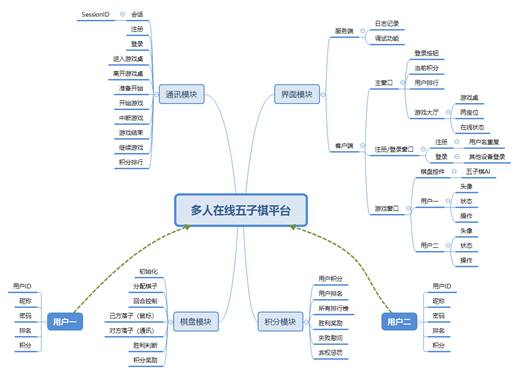

 

下图是完整的ER图以及各个子模块之间的联系

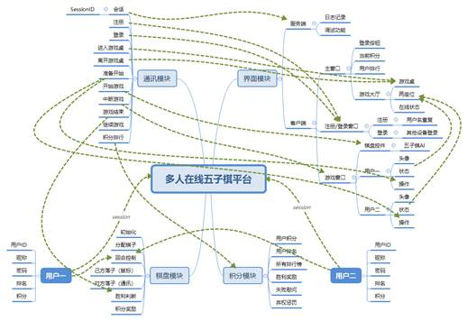

# 六、程序详细设计及主界面呈现

## （1）    游戏大厅界面

启动程序后就建立了与服务端的连接，开启一个session，每个客户端被赋予一个独一无二的sessionID。服务器维护一个经过封装的会话list，通过sessionID来判断是哪个客户端。封装后的sessionInfo类，包含了sessionID、用户昵称、用户ID、游戏桌位置等，并且在和客户端进行通讯时判断用户的位置是否正确，如果有误则进行纠错处理，将系统损失降低到最小。

启动时进入了游戏大厅，此时会显示所有游戏桌的状态。在客户端与服务端连接成功后，服务端就向客户端发送了特定的数据包。这段数据中涵盖了当前所有游戏桌的人数状态，采用简短的XML格式，包括每个游戏桌座位上的用户昵称、ID、准备状态等。

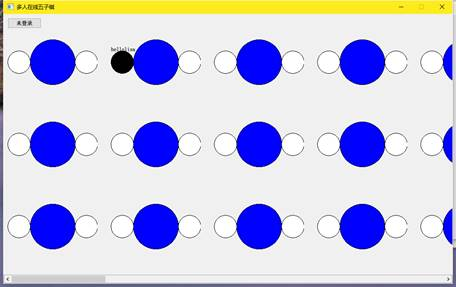

如上图，每个游戏桌可分为桌子、两边的座位。每个座位默认是白色，表示没有人在这里。一旦有人进来，服务端会发送所有游戏桌的数据给所有在线的用户，客户端SocketUtil类收到数据，通过判断里面的kind关键字来分发数据给对应的窗口对象，游戏大厅窗口收到数据进行处理，座位变成黑色，表示已经有人了，同时在座位的上方打印玩家的昵称，用来辨认。上图中的第二张游戏桌的左边位置已经变黑，座位上面还显示了玩家的昵称helloLisa。

如果没有登录，左上角只有一个“未登录”按钮，再进行任何操作例如点击登录按钮、点击游戏桌等，都会强制要求跳转到注册/登录界面，登录成功后才能继续操作。登录后的样子如下图所示。

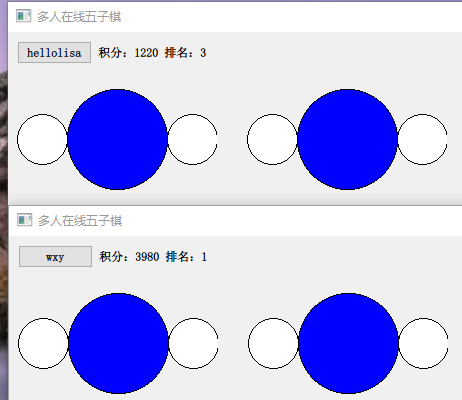

原先的“未登录”按钮变成了用户的昵称，而后面多了两条信息，分别表示用户的当前积分、个人排名。积分是在游戏后才能获得，而排名则是代表当前用户在所有用户之中的排行。相同积分的用户排名相同，而不是简单的按照名称排序。点击用户名按钮，可以看到所有用户的积分排名。

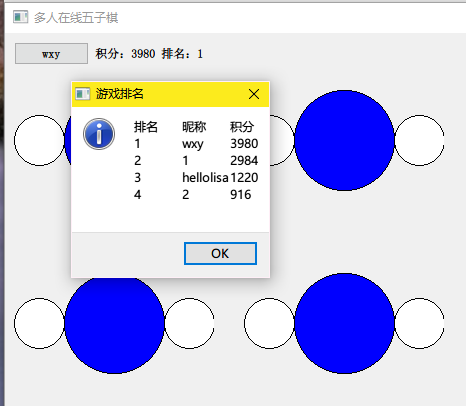

点击用户名按钮，客户端发送查看排行榜的请求给服务端，服务端收到数据后访问所有用户，进行排序，并且将客户端需要的数据发送给客户端，包括排名、昵称、积分等，同样是封装成XML数据，客户端收到后弹出MessageBox对话框，读取所有用户排名，展示给用户看。

点击任意一张桌子，都可以进入游戏等待界面。

## （2）    注册登录界面

在游戏大厅中进行任何操作，如果没有登录的话，会强制要求跳转到注册登录界面。注册登录界面略显简陋，由两个垂直排列的对话框和两个水平排列的按钮组成，分别是账号、密码、注册、登录。

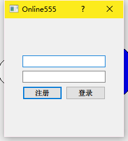

注册时，如果用户昵称已经存在，则会提示注册失败，重新换个名字。因为用户名代表了这个用户的个性化，早点注册的用户有更多的可能获取到自己喜欢的用户名。

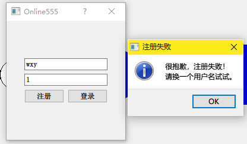

登录时，如果用户已经在其他设备登录，则不允许再次登录。这是为了避免多人用同一个账号刷积分，保障积分系统的公平性与稳定性。

如上图，一个客户端用helloLisa账号登录，而第二个客户端也尝试用同样的账号登录，这时就会返回登录错误，要求用户更换账号。

注册成功后，通过MessageBox弹出“注册成功”的话语，并且提示用户牢记自己的账号和密码。

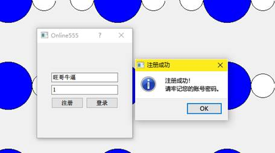

登录成功后，通过MessageBox弹出“欢迎回来”字样的对话框，接着自动关闭登录窗口。

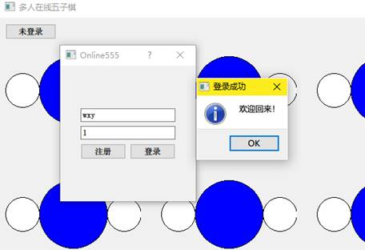

登录后，游戏大厅会显示用户的信息，用户昵称、用户积分、用户排名。

## （3）    五子棋界面

该界面由三部分横向的布局组成：左边是用户一的头像、状态、操作按钮，中间是五子棋棋盘的控件，右边是用户二的头像、状态、操作按钮。

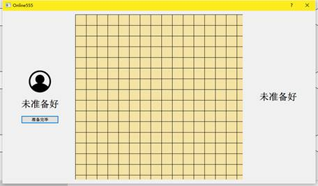

头像分为黑白两色，黑色表示该用户使用的是黑棋，白色则相反，代表白棋。头像下方的标签显示了用户的状态，刚进入游戏桌时默认为“未准备好”，而且状态标签下方的按钮会显示“准备完毕”。点击准备完毕后，“未准备好”标签变成醒目的红色，文字也变为“等待开始”。而原先的按钮文字变成“取消准备”。在游戏开始之前随时都可以取消准备，变成原先的状态，不会有任何影响。

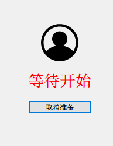

同一个游戏桌对面用户，不会显示准备按钮，因为无法干预对方的准备状态。而对面如果没有人，则不会显示头像，直至对手进入游戏桌，自动显示头像。

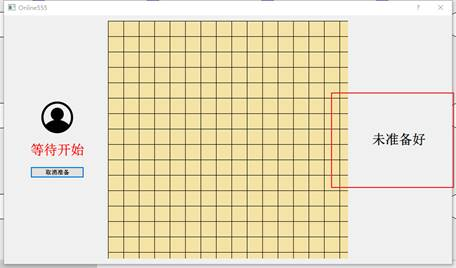

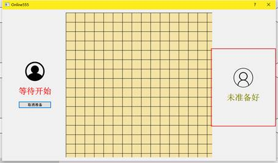

当对手进入游戏桌后，黑色的“未准备好”字样变成了暗黄色的“未准备好”，用以提示己方用户已经有人进来了，改准备开始游戏了。等对方准备完毕，则立即开始游戏，不再给予等待时间。

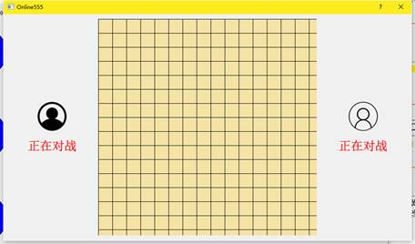

按照五子棋的规则，黑棋先下，即代表头像为黑色的用户一方先落子。用户可以用鼠标点击棋盘的任意一个位置，如果范围超出了棋盘或者已经落子，那么该次点击不会有任何效果，相等于没有进行操作。用户每下一个子，都会发送数据给服务端，由服务端进行保存状态和转发给对面的玩家。对面玩家在收到落子信号前不能进行任何的落子操作。

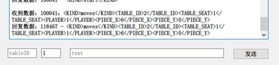

对面玩家的客户端收到了都成服务器的`<KIND>moves</KIND>`文本信号，客户端在数据中提取出落子位置，游戏桌ID、用户座位、棋子横坐标、棋子纵坐标，然后由程序模拟对方用户进行自动操作。落完子后进入下一回合，刚落子的用户便无法操作，需要等待对方落子，继续由服务器进行转发落子信号，在自己的棋盘上落子。这样来回循环直至游戏结束。

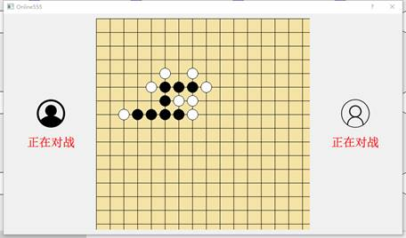

 

游戏胜利，由胜利的一方的客户端发送数据给服务端，然后服务端根据双方的状态判断用户端是否是真的胜利，若有错则进行纠错处理，发送逻辑出错的error信号。目前五子棋稳定性极高，还没有遇见过出错的情况。

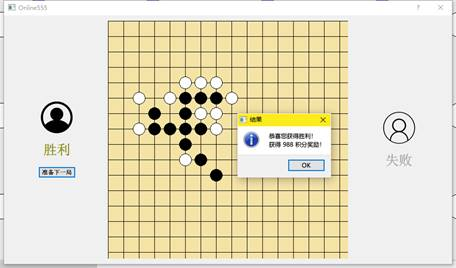

获胜的一方可以获得大量的积分奖励，游戏胜利后弹出对话框显示结果，并且显示奖励的积分数量。同时原先的头像下方的状态标签变为暗金色的“胜利”二字，对面失败者的状态标签则变成“失败”，并且是惨淡惨淡的灰色。

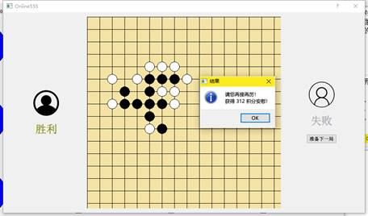

失败者也会受到安慰的少量积分，大概是胜利者的三分之一不到。

游戏结果出来之后，双方各自的操作按钮会继续显示，按钮文字变成“准备下一局”。点击此按钮则重新进入准备状态，红色的“等待开始”，可以进行下一局。

此时如果有一方离开了游戏桌，那么其状态标签会改成灰色的“对方已离开”，头像也一起隐藏起来。

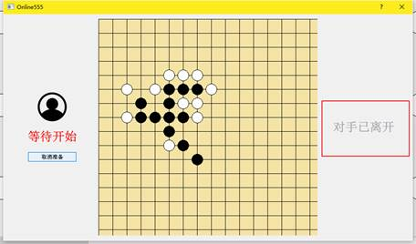

除此之外，如果是在游戏途中离开，会询问“当前您正在对战，如果现在退出将会默认对方胜利，并且扣除自己的积分。是否继续？”。点Yes会退出游戏桌，惨淡收场。

玩家中途退出后，剩下的一方将会立即获得胜利，但不会奖励积分。这是为了避免刷积分引起的操作。放弃掉的一方头像消失，状态变成“对手已放弃”。胜利者恢复到比赛开始的“未准备”状态，等待继续准备。

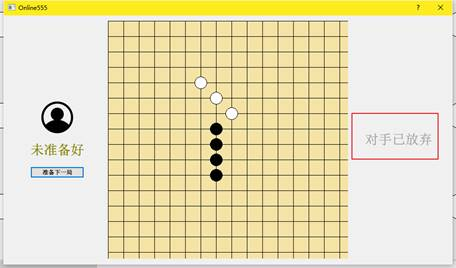

 

## （4）    服务端界面

服务端主要用于数据存储和数据传输，无需手动干预，故界面仅由两部分组成，一是日志控件，二是调试控件。

服务端在启动时会读取文件中存储的用户信息：用户ID、昵称、密码、排名，依次添加进一个封装后的UserInfo类，并且使用List构成一个用户数组，包含了所有的用户信息。打印用户数量至日志控件。

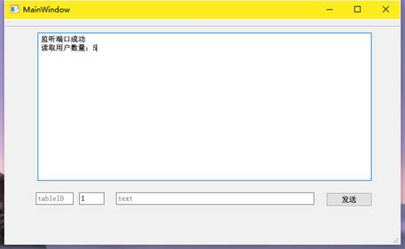

在日志控件下面，是一排水平放置的调试功能的空间布局，分别是游戏桌ID、座位号、发送的数据文本。这片布局仅仅用来开发时进行调试，根据传输的数据和客户端的反应来判断逻辑有没有出错。目前已经完成了其调试的使命，暂时不需要理睬。

在服务端界面中，可以看到所有传输的数据，例如下图新的客户端进入与登录的XML格式的数据。

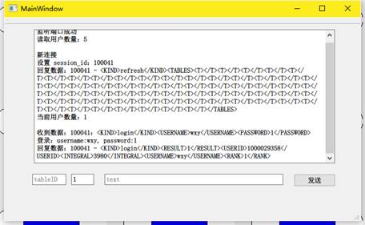

如上图，客户端启动后设置唯一的sessionID给客户端，并且保持连接。同时获取到所有游戏桌的玩家状态，用<T>标签包裹起来，返回给客户端，最后到客户端的游戏大厅中刷新，有人的座位变黑，并且显示相应位置的玩家昵称。

在注册/登录后获取到账号密码，与用户列表中的信息进行匹配，如果登录成功就返回1，登录失败则返回0。图中的数据是登录成功，于是在`<KIND>login</KIND>`XML文本中标记了RESULT为1，并且添加上了存储在服务端的用户信息返回给客户端。客户端读取后显示在自己的界面之上展示给用户。

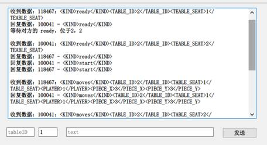

上图是双方玩家准备完毕后的收发的数据，所有文本皆显示在上面。一个玩家准备，发送结果给游戏桌对面的玩家。如果双方都已经准备好了，则发送`<KIND>start</KIND>`内容给双方，开始游戏。每一个落子的信号也是封装在一个<KIND>moves</KIND>``文本之中，同时这串文本带有落子的位置，服务端收到落子信号后转发给游戏桌对面的玩家，对面玩家客户端收到信号后游戏界面存放五子棋数据的数据设置相应的位置为对方棋子，然后进入下一轮，即对方落子。接着对方也发送信号过来，继续互相传输落子数据，直至游戏结束。

 

# 七、代码实现

此处应该略过，毕竟是 gayhub，自己找源代码吧，注释很多的。

 

# 八、总结

总的来说，这次课程设计是做得最顺利的一次了……老师布置了题目之后，就在光棍节的那一天，那一个周末，我闲得无聊，就开始着手做课程设计了。既然都要做，那么就不如直接选个最有趣的吧，于是一眼就看中了棋牌类在线游戏平台。虽然觉得是最难的……但试试又无妨。

以前已经做了好几次的五子棋，分别是安卓、C、Java，这次恰逢好机会就打算用C++做一个图形化的。而且刚好有空，便开始新建工程。

虽然有些小意外，比如莫名失效的信号槽机制，我就调试了6个多小时……而且没有任何进展。不过这个应该不是我的锅吧。还有Session，怎么在刚开始连接的时候就知道是哪个用户，连接时好像并不能传送数据，总不能等到传送数据时再进行维护吧，于是想了一会儿，就干脆在新连接进入时增加了一个sessionID，还封装了一个SessionInfo类来进行维护会话列表。这些都很顺利，轻车熟路了。而且QT对Socket的封装真的特别特别友好，多线程什么的完全不需要我考虑，只需要把功能实现就行了。也不会产生阻塞、溢出什么的，实在是太省心了。

然后一不小心，就差不多完成了。

多人在线五子棋平台最麻烦的地方就是调试了，服务端只能一直写一直写，写好后再统一运行，出了错误也得重新打开两个客户端慢慢调试。因为debug机制只能调试一个客户端，干脆就直接在服务端输出调试的日志了，显示数据传输的所有内容，顺带还打印log。

再加上了伪造发送数据的调试控件组，就是手动写数据发送给客户端，这样就能知道客户端的状况，以及跳过了数据发送出现的更加容易出现bug的隐患。这个调试的方法应该算是比较新颖的吧，而且确实非常好用呢。

时间比较仓促，因为还有好几个项目要赶，就花了匆匆的两天时间大概24小时吧。除去无用的找框架bug的时间，粗略估计约15个小时。没有好好地修改界面，看起来界面会比较丑，但是无伤大雅，能看就好。等以后有空了再好好地修改界面，让它能够发布出去，给其他人尝尝鲜。

虽然除了QT的socket用法以外，我并没有学到多少其他知识，但是也增加了一些开发经历，算是有不小的收获吧。

 